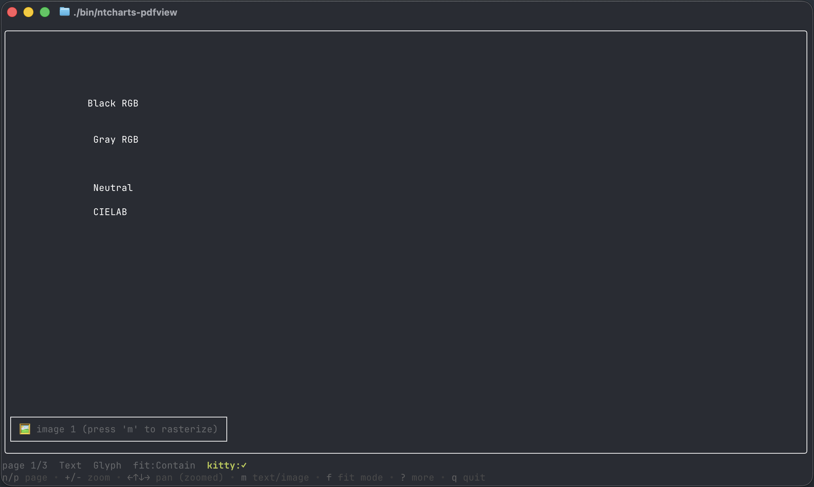

# ntcharts-pdf — Terminal PDF viewer widget for Bubble Tea

<p>
    <a href="https://github.com/NimbleMarkets/ntcharts-pdf/tags"></a>
    <a href="https://pkg.go.dev/github.com/NimbleMarkets/ntcharts-pdf?tab=doc"></a>
    <a href="https://github.com/NimbleMarkets/ntcharts-pdf/blob/main/CODE_OF_CONDUCT.md"></a>
</p>


`ntcharts-pdf` is a [Bubble Tea](https://github.com/charmbracelet/bubbletea) widget that renders PDF documents in the terminal. It pairs [`ledongthuc/pdf`](https://github.com/ledongthuc/pdf) for pure-Go text extraction with [`ntcharts/v2/picture`](https://github.com/NimbleMarkets/ntcharts) for image rendering — half-block glyphs anywhere, full-resolution Kitty graphics on terminals that support them (Kitty, Ghostty, WezTerm).  Browser-based image rendering uses [`@embedpdf/pdfium`](https://www.npmjs.com/package/@embedpdf/pdfium).

<p align="center"></p>

The widget has two modes:

- **Text mode** extracts plain text from the PDF and shows styled placeholders for embedded images.
- **Image mode** rasterizes pages via a pluggable `Renderer`. The default backs onto [`go-pdfium`](https://github.com/klippa-app/go-pdfium) running PDFium as WebAssembly (via [wazero](https://wazero.io)) — **CGO-free, no system dependencies, no external binaries.** Bring-your-own renderers (server-rasterized PNGs, MuPDF, etc.) plug in via the same interface.

## Quickstart

```go
package main

import (
    "fmt"
    "os"

    tea "charm.land/bubbletea/v2"
    "github.com/NimbleMarkets/ntcharts-pdf/pdfview"
)

type model struct{ pv pdfview.Model }

func (m model) Init() tea.Cmd { return m.pv.Init() }

func (m model) Update(msg tea.Msg) (tea.Model, tea.Cmd) {
    if k, ok := msg.(tea.KeyMsg); ok && (k.String() == "q" || k.String() == "ctrl+c") {
        return m, tea.Quit
    }
    if sz, ok := msg.(tea.WindowSizeMsg); ok {
        return m, m.pv.SetSize(sz.Width, sz.Height)
    }
    var cmd tea.Cmd
    m.pv, cmd = m.pv.Update(msg)
    return m, cmd
}

func (m model) View() tea.View { return m.pv.View() }

func main() {
    pv := pdfview.NewWithConfig(pdfview.Config{InitialPath: os.Args[1]})
    if _, err := tea.NewProgram(model{pv: pv}).Run(); err != nil {
        fmt.Println(err); os.Exit(1)
    }
}
```

Page with `n` / `p`, toggle Text ↔ Image with `m`, swap Glyph ↔ Kitty with `g`, zoom with `+` / `-`, pan with arrows, fit with `f`, reset view with `0`. The widget's `Update` dispatches all of these through `DefaultKeyMap()`; rebind a field to change the keystroke (or set a binding to `key.Binding{}` to disable it).

## Demo

A fuller demo lives at [`examples/pdfview`](./examples/pdfview/main.go) — adds a status bar, help bubble, and reload key.

```sh
task build-ex-pdfview
./bin/ntcharts-pdfview path/to/your.pdf
```

## Modes

| Mode | What it does | Where it works |
|---|---|---|
| `pdfview.TextMode` (default) | Plain text via `ledongthuc/pdf`, styled with lipgloss; embedded images shown as boxed placeholders | Everywhere, including WASM |
| `pdfview.ImageMode` | Rasterized page via a `Renderer` (default: `go-pdfium`/wazero on native, the `@embedpdf/pdfium` JS bridge under `GOOS=js`), fed to `ntcharts/v2/picture`. Supports zoom (`+`/`-` up to ×64) and pan (arrow keys when zoomed) | Native + browser-WASM out of the box; WASI needs a custom `RendererFactory` |

`pv.ToggleMode()` returns a `tea.Cmd` that swaps modes and re-renders. Image mode internally uses `picture.PictureGlyph` (universal half-blocks) or `picture.PictureKitty` (high-resolution); switch between them with `pv.ToggleRenderMode()`.

## Renderer

```go
type Renderer interface {
    RenderPage(pageNum, dpi int) (image.Image, error)
    Close() error
}

type RendererFactory func(name string, data []byte) (Renderer, error)
```

The factory is **bytes-first**: the widget reads file contents once (subject to `Limits.MaxFileBytes`) and hands the bytes to the factory, so custom factories never have to implement their own file I/O. Hosts that already have the bytes in memory — an `//go:embed` blob, an HTTP response, a server-pushed buffer — can skip the path round-trip via `pv.SetPDFData(name, data)` or `Config.InitialData` / `InitialName`.

The widget treats `Config.RendererFactory` as optional. When nil, `NewWithConfig` calls `DefaultRendererFactory()`:

- **Native builds** return a `go-pdfium`-backed factory. The first call lazily initialises a wazero pool with the embedded `pdfium.wasm` blob (cold start ~hundreds of ms; warm calls are fast).
- **Browser-WASM (`GOOS=js GOARCH=wasm`)** bridges to the host page's [`@embedpdf/pdfium`](https://www.npmjs.com/package/@embedpdf/pdfium) instance via `syscall/js`. The host loads `web/pdfium-bridge.js` (which expects `@embedpdf/pdfium` to resolve through an import map), and that script populates `window.ntchartsPDFium` — Go's setupBridge() picks it up and uses the same PDFium engine that runs natively. See `web/index.html` for the full wiring.
- **WASI (`GOOS=wasip1 GOARCH=wasm`)** returns nil. wazero can technically run interpreted inside WASI but the performance would be unusable for PDF rasterization.

When the factory returns nil (or fails), ImageMode requests fall back to TextMode at View() time. Hosts that ship a server-side rasterizer can wire up their own `RendererFactory` and keep Image mode in WASM. Each loaded document gets its own `Renderer`; `pv.Close()` releases the document handle eagerly when a longer-lived host wants explicit cleanup.

### Loading APIs

| Call | When to use |
|---|---|
| `pv.SetPDF(path)` / `Config.InitialPath` | PDF is on disk; widget reads it once (`Limits.MaxFileBytes` enforced via `os.Stat`) |
| `pv.SetPDFData(name, data)` / `Config.InitialData` + `InitialName` | PDF bytes already in memory (embedded, fetched, pre-decompressed); `len(data)` checked against `MaxFileBytes` |

`Config.RenderDPI` (default 300) sets the rasterization resolution; raise it for crisper Kitty output, lower it to trade fidelity for speed.

### Renderer state introspection

- `pv.HasRenderer() bool` — true when the configured factory actually opened a Renderer for the current document. False after a failed factory call (a hostile-doc rasterizer init failure, or no factory configured on WASM). Pair with the next.
- `pv.RendererErr() error` — the most recent factory error, persisted across the document's lifetime (cleared on the next `SetPDF`). Surface it in your status bar to explain why ImageMode is unavailable.

## Resource limits (`Config.Limits`)

PDFs are an untrusted-input format; hostile or malformed documents can claim billions of pages, demand 100 GB rasterizations, or panic the parser. `Config.Limits` exposes conservative caps applied automatically:

| Field | Default | What it caps |
|---|---|---|
| `MaxFileBytes` | 256 MiB | File size before the default renderer reads it (filesystem paths only) |
| `MaxPages` | 10 000 | Refuses to load PDFs claiming more pages |
| `MaxImagesPerPage` | 1024 | Caps placeholder enumeration per page |
| `MaxRenderDPI` | 600 | Per-call DPI clamp applied to every renderer (custom factories included) |
| `MaxRenderPixels` | 100 000 000 | Default renderer queries page size and lowers DPI to fit the bitmap budget |

Set any field to `-1` to disable that cap for trusted input; zero uses the default. Per-page text extraction is panic-guarded — a malformed page yields an empty placeholder rather than crashing the load.

### Sanitizing PDF-derived strings

PDF metadata, error messages, and host-supplied paths can carry C0/C1 control sequences and Unicode bidi format chars ("Trojan Source"-style attacks). The widget's own status text is already sanitized. For host-displayed strings derived from the PDF or its filename — e.g. `RendererErr().Error()` rendered into your status bar — use `pdfview.SanitizeForTerminal(s string) string`, which drops anything outside Unicode's printable categories and folds newlines / tabs to single spaces.

## Known caveats

- **Binary size grows by ~5 MB** from the embedded `pdfium.wasm` blob. The first ImageMode toggle pays a wazero compile cost (hundreds of ms); subsequent renders are fast. Programs that never enter ImageMode skip the cost entirely (pool init is `sync.Once`-gated and deferred to the first factory call).
- **Browser-WASM ImageMode requires the host page to load `web/pdfium-bridge.js`.** This script expects `@embedpdf/pdfium` to be resolvable as an ES module (npm install + bundler, or a vendored copy reached via an `<script type="importmap">`). Without it, `setupBridge()` returns an error on the first ImageMode toggle and ImageMode degrades to TextMode — the rest of the widget keeps working.
- **WASI builds have no built-in image renderer.** `DefaultRendererFactory` returns nil. Hosts that need rasterization there can wire up a server-side rasterizer via `RendererFactory`; custom factories supplied in WASM environments are also responsible for their own resource caps (file size, request timeouts) since `Config.Limits.MaxFileBytes` is only enforced by the default local-filesystem renderer.
- **PDFs are read fully into memory before rasterization.** `go-pdfium`'s `OpenDocument` takes a `[]byte`. For typical documents (single-digit MB) this is fine; multi-hundred-MB PDFs will use proportional RAM. Streaming open is possible via a custom RendererFactory.
- **Per-page text extraction failures (including library panics) drop the page to an empty placeholder** rather than failing the whole load. A page that ledongthuc/pdf can't decode or that triggers a parser panic renders as a blank grid + image placeholder; ImageMode still rasterizes it correctly.
- **Image placeholders count XObject entries with `/Subtype /Image`** in the page resources. Inline images (BI/EI operators inside the content stream) aren't counted — uncommon enough not to matter for most PDFs, easy to add later if you encounter a doc that uses them heavily.
- **Kitty placement composition through lipgloss** is best-effort. `picture.Model.View()` embeds the Kitty placement escapes directly in the rendered string, which composes cleanly inside `lipgloss.JoinVertical` and basic borders but may misbehave under styles that rewrite the content (e.g. `Width` with truncation on a Kitty payload). Glyph mode has no such caveat.
- **No page caching across flips.** Each Image-mode page-flip re-rasterizes via the renderer. A 300-DPI Letter-size page through pdfium runs in ~150–300ms on a recent Mac. Layer a renderer with its own cache if your flow does heavy back-and-forth.
- **Vibe coded** This comment was inserted by a human.

## License

The embedded [`Example.pdf`](./examples/pdfview/testdata/Example.pdf) is obtained from [WikiMedia Commons under AGPL](https://commons.wikimedia.org/wiki/File:Example.pdf#Licensing).

Thanks to the [`ledongthuc/pdf`](https://github.com/ledongthuc/pdf) and [`embedpdf/embed-pdf-viewer`](https://github.com/embedpdf/embed-pdf-viewer) PDF libraries and their authors.

[MIT License](./LICENSE.txt) — Copyright (c) 2026 [Neomantra Corp](https://www.neomantra.com).

----
Made with :heart: and :fire: by the team behind [Nimble.Markets](https://nimble.markets).
